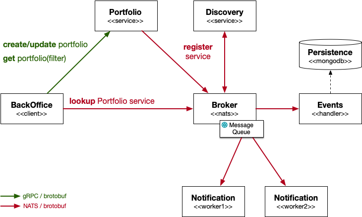

# Data streaming PoC

Proof of concept for streaming bank portfolio metadata using event sourcing.

## Prerequisites

You need to have installed:

* Go (v1.15+)
* [Task](https://taskfile.dev/#/)
* [Benthos](https://www.benthos.dev/)
* [NATS](https://nats.io/) - follow [these direction](./docs/nats-setup.md)
* [MongoDB](https://www.mongodb.com/) - follow [these direction](./docs/mongodb-setup.md)
* [Docker](https://www.docker.com/products/docker-desktop) and `docker-compose`

## Start the middleware

~~~bash
# This will start NATS & Web-UI, ...
$ docker-compose up --detach --remove-orphans
~~~
